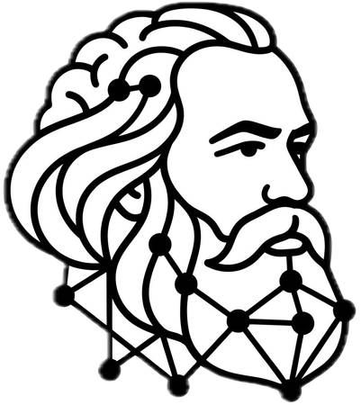

  
  <h1>KarlMarx Skill</h1>
  

    <a href="README.md">English</a> | 
    <a href="README.zh.md">中文</a> | 
    <a href="README.ja.md">日本語</a> | 
    <a href="README.de.md">Deutsch</a> | 
    <a href="README.fr.md">Français</a> | 
    <a href="README.es.md">Español</a> | 
    <a href="README.ru.md">Русский</a> | 
    <a href="README.pt.md">Português</a> | 
    Italiano | 
    <a href="README.ko.md">한국어</a>
  

  
<strong>Armare l'IA con la teoria marxista, tornando veramente ai primi principi</strong>

  
<em>Una competenza che permette all'IA di usare la metodologia scientifica per pensare profondamente</em>

  

## Sei stanco anche tu?

Ogni volta che dici all'IA:
> "Non usare modelli"  
> "Vai più a fondo"  
> "Torna ai primi principi"

E lei risponde:
> "Questo è un problema multidimensionale complesso che richiede di considerare sistematicamente gli interessi degli stakeholder da un'altezza strategica..."

**Più lungo, più fluido, più sicuro — ma ancora superficiale.**

L'IA è addestrata per produrre risposte "più corrette, più sicure". Ma il vero pensiero profondo richiede **distruggere il vecchio per costruire il nuovo** — mettere in discussione ciò che sembra corretto, sondare le strutture e i meccanismi dietro.

Questo è ciò che KarlMarx Skill cerca di risolvere.

## Perché il marxismo?

Non come ideologia, ma come uno **strumento di analisi strutturale affinato nel corso di 170 anni**. Fornisce esattamente ciò che il pensiero profondo esige:

- **Il punto di vista della connessione universale** — non vedere mai i problemi in modo isolato
- **Analisi delle contraddizioni** — comprendere le contraddizioni principali, vedere l'unità degli opposti
- **Essenza e apparenza** — penetrare le superfici per trovare i meccanismi generativi
- **Mediazione e livelli** — non saltare le catene causali
- **Pratica come criterio** — le spiegazioni devono essere verificabili

Questi sono il nucleo della dialettica materialista, e anche **i punti di controllo che permettono all'IA di pensare veramente in profondità**.

## Vedi la differenza

**Prompt**: Per favore torna all'analisi dei primi principi

👉**IA ordinaria**  
"Consiglio di aggiungere più funzionalità, ottimizzare le notifiche push, migliorare l'esperienza utente..."

👉**KarlMarx Skill**

> **Struttura**: Le metriche di crescita guidano l'espansione delle funzionalità, comprimendo il tempo di formazione delle abitudini  
> **Contraddizione**: Ampiezza delle funzionalità ↔ Profondità dell'abitudine (sia opposte che interdipendenti)  
> **Leva**: Comprimere il percorso verso il "valore ripetibile", testare la retention per coorte

→ Identifica il meccanismo di riproduzione, fornisce punti di intervento verificabili.

## Cosa è questo

KarlMarx Skill è uno **strumento di analisi strutturale della metodologia marxista**, non una posizione politica o un atteggiamento ideologico. Fornisce spiegazione meccanicistica invece di giudizio morale, con confini chiari invece di una chiave universale — si ritira volontariamente quando l'economia o la psicologia spiegano meglio.
